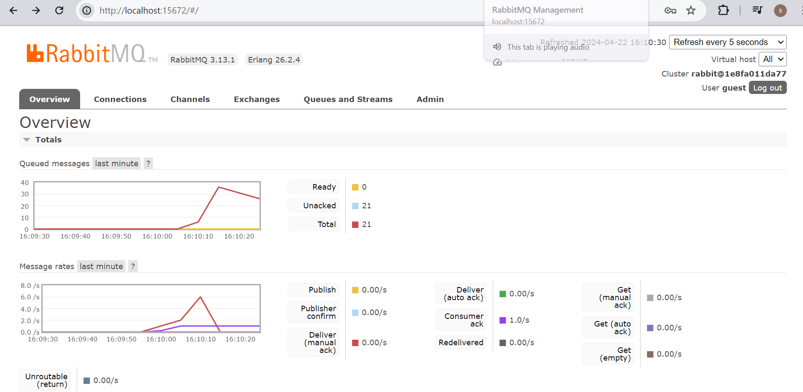

a. What is AMPQ?
    
    AMQP stands for Advance Message Queuing Protocol. AMQP  is an open standard application layer protocol for message-oriented middleware. 
    It is mainly used for developing unmatched communication operability between client and broker parties
    AMQP enables different applications or components to communicate with each other over a network, reliably and asynchronously, by exchanging messages.
b. what it means? guest:guest@localhost:5672 , what is the first quest, and what is
the second guest, and what is localhost:5672 is for?

- guest:guest : This part of the string specifies the credentials needed to access the AMQP server. (username:password)
- localhost:5672: This part specifies the host and port of the server. 

Simulation Slow Subscriber

My system uses a single queue where all messages from the publisher are sent. This queue collects all incoming messages and holds them until the subscriber processes them. The total of 30 messages represents the accumulation of unprocessed messages in the queue, showing how messages stack up faster than they are processed.

Running at least three subscribers

    From the image above, it can be observed that the spike in message queues decreased after using 3 console at least subscribers. 
    This reduction occurs because the main.rs file on the subscriber includes a sleep function (thread::sleep(ten_millis);), which introduces a delay of 1 second (1000 milliseconds) before printing messages. This delay allows the program more time to process messages sequentially, thereby reducing the buildup of queued messages. Additionally, the simultaneous operation of 3 console subscribers running cargo run may also contribute to the reduction in spikes.
    If speed is a primary concern, switching to asynchronous message delivery can be the solution to improve it. With asynchronous delivery, the publisher can continue its tasks without waiting for confirmation that the message has been sent, which can enhance efficiency
